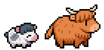
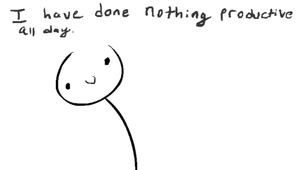

  <h1>
  
  
  
    </h1>

Hi ! I'm Beth 👋​

🎓 I'm a French Student trying to make my code work and my plants survive. I'm succeeding at one of them. 

🎮 Skills include: infinite scrolling, deleting code that worked, and pretending to read documentation​

*En français :*
> 🎓 Je suis étudiante en informatique et j'essaie de faire fonctionner mon code et faire survivre mes plantes. Je réussis à faire l'un.
> 
> 🎮 Compétences : scrolling infini, suppression de code fonctionnel et faire semblant de lire la documentation.

## Projects

- 🎮 [Games in C](https://github.com/KitsuneNoMegami/Games-in-C)  
  *A collection of simple games (C language)*
- 🐉 [Donjon & Dragons](https://github.com/KitsuneNoMegami/DnD)  
  *Console-based role-playing game (Java)*
- 🧩 [Sudoku Solver](https://github.com/KitsuneNoMegami/Sudoku)  
  *A simple Sudoku solver (Assembly language)*
- 🕸️ [Network Simulator](https://github.com/KitsuneNoMegami/Network-Simulator)  
  *A Lan network simulation (C language)*
- 💼 [Odie Rebirth of the KPI](https://github.com/KitsuneNoMegami/Odie-Rebirth-of-the-KPI)  
  *A game when your goal is to audit an entreprise*
- 👾 [Pac-Man Python](https://github.com/KitsuneNoMegami/Py-man)  
  *A small Pac-Man clone (Python)*

## Languages I know 

  
  
   
   
  

## Can code with/on

  

# 

  

