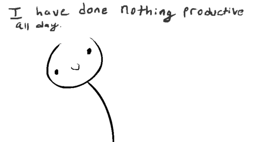

  <h1>
  
  
  
    </h1>

Hi ! I'm Beth 👋​

🎓 I'm a French Student trying to make my code work and my plants survive. I'm succeeding at one of them. 

🎮 Skills include: infinite scrolling, deleting code that worked, and pretending to read documentation​

In French

*🎓 Je suis une étudiante en informatique qui essaie de faire fonctionner mon code et faire survivre mes plantes. Je réussi a l'un des deux*

*🎮 Skills : scrolling infini, suppression de code qui fonctionne et faire semblant de lire la documentation.*

### Projects 
* [Games in C](https://github.com/KitsuneNoMegami/Games-in-C.git)
  * A collection of simple games developed in C
* [Donjon & Dragons](https://github.com/KitsuneNoMegami/DnD.git)
  * A console-based Java game inspired by Dungeons & Dragons 
* [Sudoku Solver](https://github.com/KitsuneNoMegami/Sudoku.git)
  * A simple Sudoku solver for the console in Assembly langage
* [Pac-Man Python](https://github.com/KitsuneNoMegami/Py-man.git)
  * A simple Pacman in Python

## Languages I know 

  
  
   
   
  

## Can code with/on

  

# 

  

